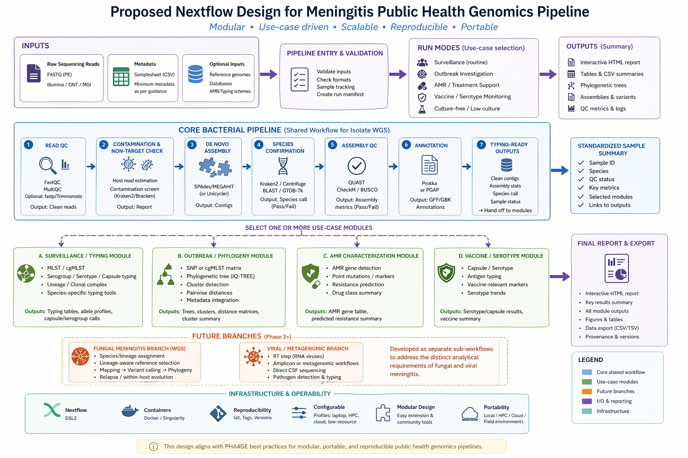

# 🧬 Meningitis Public Health Bioinformatics Pipeline (Nextflow)

A modular, use-case–driven Nextflow pipeline for genomic analysis of meningitis-associated pathogens, designed for public health surveillance, outbreak investigation, and antimicrobial resistance monitoring.

---

## 🎯 Overview

This pipeline provides a **standardized, reproducible workflow** for analysing genomic data from meningitis-associated pathogens, with an initial focus on **bacterial isolate whole genome sequencing (WGS)**.

It follows a **modular design**:

- ✅ Core bacterial analysis workflow  
- ✅ Pathogen-specific typing modules  
- ✅ Public health use-case modules  


---




## 🧠 What Can This Pipeline Do?

You can use this pipeline to:

| Goal | What the pipeline does |
|------|--------|
| Routine surveillance | Identify species, perform typing (MLST, serotype), generate summaries |
| Outbreak investigation | Build phylogenies, detect clusters, compare isolates |
| AMR monitoring | Detect resistance genes and mutations |
| Vaccine monitoring | Identify serotypes / capsule types and vaccine-relevant markers |

These align with public health use cases such as surveillance, outbreak response, and treatment guidance. :contentReference[oaicite:1]{index=1}

## 🧬 Supported Pathogens (Phase 1)

This pipeline currently supports bacterial meningitis pathogens:

- *Neisseria meningitidis*
- *Streptococcus pneumoniae*
- *Haemophilus influenzae*
- *Streptococcus agalactiae*

Future extensions will include:

- Fungal meningitis (e.g., *Cryptococcus spp.*)
- Viral / metagenomic workflows

## 📥 Input Requirements

### Required

- Paired-end sequencing reads (`FASTQ`)
- Sample metadata (`.csv`)

### Optional

- Reference genome (for outbreak analysis)
- Custom databases (AMR, typing, etc.)


## 📊 Pipeline Structure

### Core Workflow
```
INPUT READS + METADATA
        ↓
QC → contamination check → assembly → species confirmation → assembly QC → annotation
        ↓
STANDARDIZED SAMPLE OUTPUT
```

### Then select one or more modules:

```
├── surveillance_typing
├── outbreak_phylogeny
├── amr_characterization
└── vaccine_serotype_capsule
```


### Final Output:

- Reports (HTML, CSV)
- Typing results
- Phylogenetic trees (if selected)
- AMR summaries (if selected)


## ⚙️ Installation

### 1. Install Nextflow

```bash
curl -s https://get.nextflow.io | bash
```

### ▶️ How to Run the Pipeline

####  1. Routine Surveillance
```
nextflow run main.nf \
  --input "data/*.fastq.gz" \
  --metadata samplesheet.csv \
  --mode surveillance \
  --outdir results \
  -profile docker
```

👉 Use this when:

- You want species ID, MLST, serotyping
- Routine lab surveillance
 
####  2. Outbreak Investigation

```
nextflow run main.nf \
  --input "data/*.fastq.gz" \
  --metadata samplesheet.csv \
  --mode outbreak \
  --reference ref.fasta \
  --outdir results \
  -profile singularity,hpc
```

👉 Use this when:

- Comparing isolates
- Identifying clusters or transmission events

####  3. AMR Monitoring

```
nextflow run main.nf \
  --input "data/*.fastq.gz" \
  --metadata samplesheet.csv \
  --mode amr \
  --outdir results \
  -profile docker
```
👉 Use this when:

- Monitoring antibiotic resistance
- Supporting treatment decisions

####  4. Vaccine / Serotype Monitoring

```
nextflow run main.nf \
  --input "data/*.fastq.gz" \
  --metadata samplesheet.csv \
  --mode vaccine \
  --outdir results \
  -profile docker
```

👉 Use this when:

Tracking serotype distribution
Monitoring vaccine impact

---

### 📁 Output Structure

```
results/
├── qc/
├── assembly/
├── species/
├── typing/
├── amr/
├── phylogeny/
└── reports/
    ├── summary.csv
    └── final_report.html
```

### 🧱 Repository Structure

```
meningitis-ph-pipeline/
├── main.nf
├── modules/
├── subworkflows/
├── assets/
├── conf/
├── containers/
└── results/
```

Pipeline is built using:

- Nextflow DSL2
- Modular processes
- Containerized tools (Docker/Singularity)

---

### 🖥️ Running Environments

This pipeline supports:

- 💻 Local machines
- 🧠 HPC clusters
- ☁️ Cloud environments

Designed according to public health infrastructure best practices, including portability and reproducibility.

---

### 🔬 Design Principles

- Modular (run only what you need)
- Reproducible (containerized)
- Scalable (local → HPC → cloud)
- Public health–focused outputs

---

### ⚠️ Important Notes
- Phase 1 focuses on bacterial isolate WGS
- Metagenomics and fungal workflows are planned future extensions
- QC thresholds and outputs are standardized for consistency

---

### 🚀 Future Development
- Fungal meningitis workflows
- Viral / metagenomic pipelines
- Real-time / nanopore integration
- Enhanced reporting dashboards

---

### 🤝 Contributing

This pipeline is developed in alignment with public health bioinformatics best practices.

Contributions are welcome:

- Add new modules
- Improve documentation
- Suggest tools or standards

--- 

## 📜 License

[*Add License]

---

## 📬 Contact

[Name / Project / PHA4GE]

---